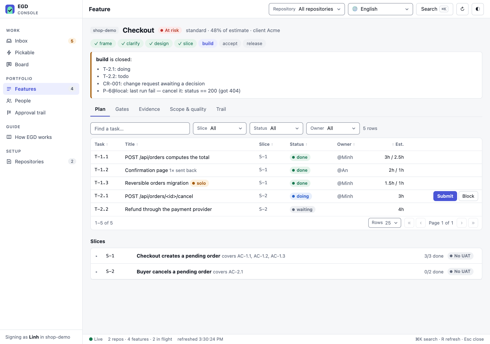
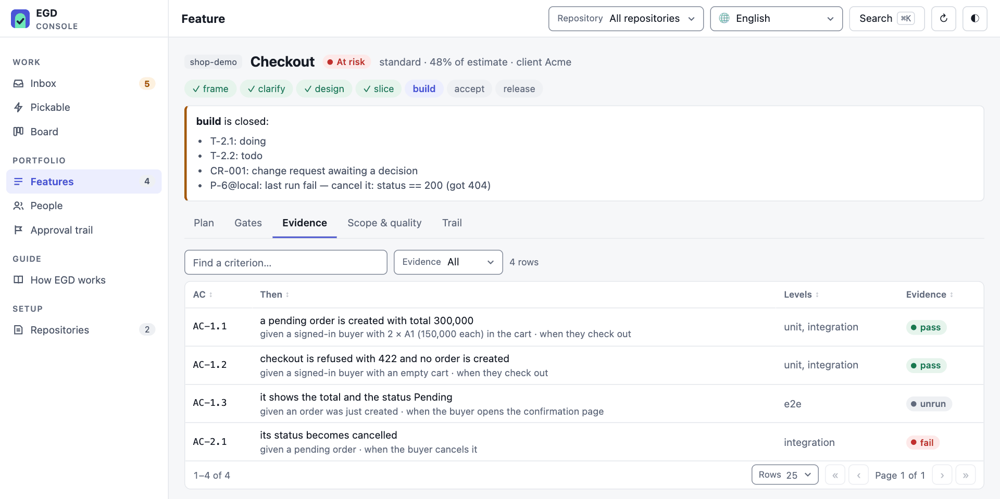
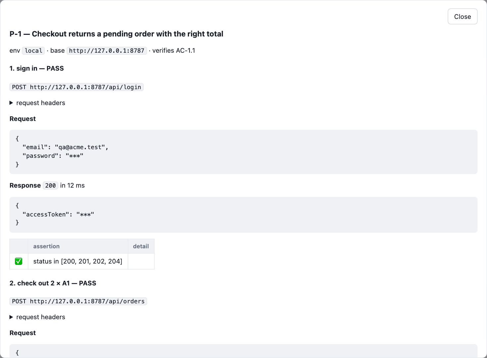
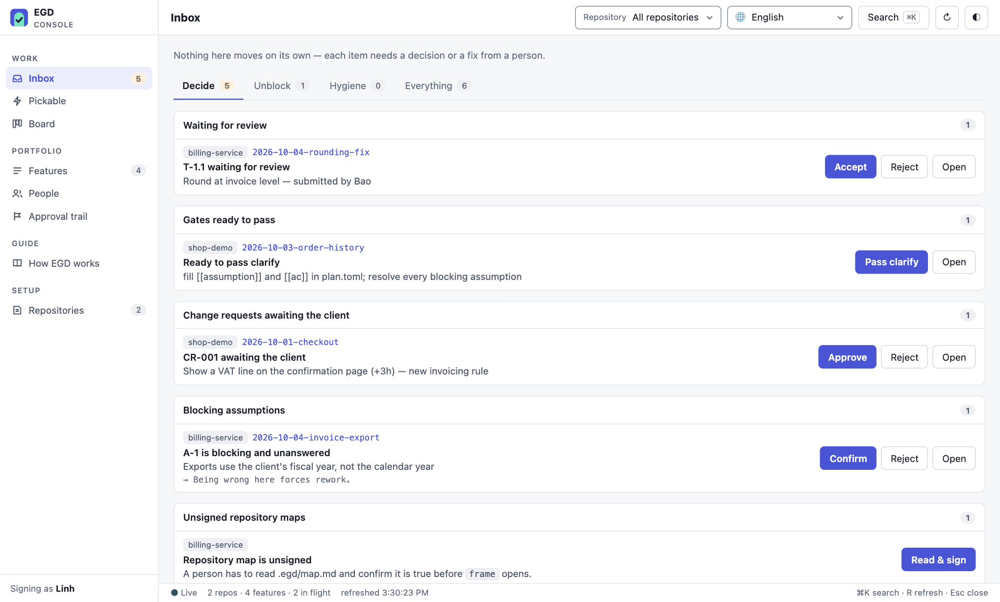

<p align="center"></p>

<h1 align="center">EGD — Evidence-Gated Delivery</h1>

<p align="center"><b>Plan it, build it, prove it — through gates your team and your client can trust.</b></p>

EGD keeps software delivery honest for small teams and freelancers who build with AI agents.
The plan lives in reviewable files, progress in an append-only event log, and a small CLI
computes every gate from both — so "done" means *agreed, reviewed and proven*, not *claimed*.
A Claude Code plugin makes agents follow the same rules as people.

```
frame ─▶ clarify ─▶ design ─▶ slice ─▶ build ─▶ accept ─▶ release
 why      what       how      order    works    client     ships,
                                                agrees     can undo
```

**Light by design:** one Python package with no dependencies, starts in a few hundredths of a
second, and keeps everything as plain files in your repository. No server, no database, no account.



## Install

```bash
curl -fsSL https://raw.githubusercontent.com/LocTran12310/egd/main/install.sh | sh
```

| | |
|---|---|
| **Install** | the line above — the `egd` CLI (through uv, or pipx) and, when Claude Code is on the machine, its plugin |
| **Update** | `egd update` — the CLI and the plugin; restart Claude Code afterwards |
| **Uninstall** | `egd uninstall` — lists what EGD installed (CLI, plugin, console settings and background service, Playwright in `~/.egd/ui`, Docker leftovers), asks, removes it. Kept: every repository's `.egd/` (`.egd/.auth/` sessions too) and Playwright's shared browser cache (`ms-playwright`) |

Runs on macOS and Linux; on Windows, use WSL. Needs git; uv brings its own Python (pipx needs
Python 3.11+).

## Your first feature in 5 minutes

A `lite` feature, from nothing to released, in a git repository. You sign as yourself
(`git config user.name`); a teammate accepts your task.

```bash
egd setup                     # .egd/ — then set test_command = "pytest {tests}" under [proof]
                              # in .egd/config.toml
egd new checkout --tier lite  # then write brief.md: Problem, Outcome, Success signal, Out of scope
egd pass frame
egd add ac --given "a cart with 2 × A1 at 150,000" --when "the buyer checks out" --then "the total is 300,000"
egd pass clarify
egd add slice --title "Checkout shows the total" --covers AC-1.1 --demo "check out, see 300,000"
egd add task --slice S-1 --title "Compute the total" --estimate 2 --touches 'src/cart/**' \
    --tests tests/test_cart.py --done "the total is 300,000"
egd add proof --kind test --verifies AC-1.1 --title "Cart total" --tests tests/test_cart.py
egd pass slice
egd start T-1.1               # write the code; commit with "T-1.1" in the message
egd submit T-1.1 --confirm    # runs the task's tests, checks it changed only its touches
egd accept T-1.1 --by Bob     # a teammate reviews it — never the person who did the work
egd verify --run              # one last pass: tests, proofs, every gate ahead
egd pass build
egd pass release              # once release.md says how to roll back
```

Lost? `egd` alone shows where every feature stands and the one command to run next; `egd check`
says why a gate is closed and the command that fixes it. `egd add <kind> -h` shows each kind's
options with an example, and a wrong entry comes out with `egd rm <id>`. The `standard` tier adds
`design` and the client's `accept`.

## Why EGD

- **Gates are code, not advice.** `egd pass build` is refused while a task is open, a change
  request is pending, or a required proof is failing or stale. Nobody — person or agent —
  talks their way past it.
- **Evidence for any kind of work.** `http` transcripts for APIs, `cli` for jobs and data,
  `test` for your test runner, `ui` screenshots per viewport — the proof skill picks the kind
  per AC, and ui proofs sign in by themselves. `egd proof setup` installs the browser once per
  machine. A backend ticket gets real evidence, not a skipped screenshot.
- **Scope is locked after `clarify`.** Changing an acceptance criterion needs a change request
  the client approves — on fixed-price work, that is your margin.
- **Four eyes by default.** Nobody accepts their own work. Working alone is allowed, and
  recorded as such.
- **Agents by task.** Each ready task names its agent and model — Opus for risky work, Haiku for
  small plain work, Sonnet otherwise, or what the plan sets; the plugin hands a wave out that way.
- **Made for teams.** One event per file, so the trail never conflicts in git; one writer per
  repository at a time; roles decide who may pass gates, review, run UAT or approve changes.
- **Client-ready output.** Weekly reports in English or Vietnamese, PR descriptions with an
  AC → evidence table, release notes, and delivery metrics from the trail.

| Acceptance criteria → evidence | An API proof, secrets redacted |
|---|---|
|  |  |

## Day to day

| Step | You run | EGD checks |
|---|---|---|
| **Plan** | `egd add ac/task/proof …`, `egd rm …` (or edit `plan.toml`), `egd pass frame/clarify/design/slice` | brief written, map signed, assumptions resolved, tasks ≤ 4 h with a footprint |
| **Build** | `egd start` → code, commit with the task id → `egd submit --confirm` → a teammate's `egd accept` | tests pass, only declared files changed, someone else reviews |
| **Prove** | `egd proof run`, `egd verify --run` | every required proof passes on the current code |
| **Ship** | `egd pass build`, the client's `egd uat S-1 --pass`, `egd pass accept`, `egd pass release` | UAT per slice, no serious defect open, a rollback written |

Also: `egd close` (a feature that stops: dropped, a research spike, superseded) · `egd standup` · `egd board` · `egd report <feature> --lang vi` · `egd cr open` ·
`egd bug open` · `egd metrics` · `egd pr` · `egd sync github`. Any command that works on a
feature takes `-f <feature>` (or just its name — `egd <feature>` alone is its status); `egd -h`
lists every command by stage, and a typo gets a *did you mean …?*.

**Shared or on your machine.** By default `.egd/` is committed, so the team shares the plan and
the trail. `egd setup --local` keeps it on this machine instead (through `.git/info/exclude` —
the repository's files stay untouched); bare `egd` warns if git still tracks files there.

**Stack profiles.** `egd setup` detects the stack (python, node, react, go) and sets the test
command; `egd profile` shows its conventions, review checklist and the done_when items it asks of
tasks touching certain files. Tune one for a repository (`egd profile --new shop --from react`,
committed in `.egd/profiles/`) or for all yours (`--mine`, in `~/.egd/profiles/`).

**Who signs.** Commands that record something sign as you — `$EGD_USER`, else your
`git config user.name`, matched to your entry in `.egd/team.toml` (name, GitHub handle or
`aliases`) and echoed as `signed as …`. `--by NAME` signs for someone else, such as the
client's UAT verdict. Agents always name the signer: inside Claude Code an implied signature
is refused.

## Console — every repository on one screen

For the PM, lead or QA juggling several projects: `egd console` (→ http://127.0.0.1:8780)
reads every registered repository and puts what needs a person first.



- **Inbox** — reviews waiting, gates ready to pass, change requests and UAT awaiting the
  client; then what is stuck, then hygiene. Read-only repositories wait in their own section.
- **Act in place** — accept, reject, pass a gate, record UAT (walking the demo script as a
  checklist), approve a CR, submit or finish a task — the CLI's own transitions, signed with
  your name for that repository.
- **Board, Pickable, Features, People, Approval trail** across repositories, and a page per
  repository: its config, team and roles, signed map and Claude Code wiring.
- **Friendly and quick** — ⌘K search, keyboard and screen-reader friendly, English and
  Vietnamese, light and dark, a built-in guide; it loads only what a page needs.

| You want | Run | |
|---|---|---|
| The console for yourself | `egd console` | → http://127.0.0.1:8780, then Repositories → Add repository… |
| Your team on the same network to see it | `egd console --lan` | prints a link with a token for your LAN address; visitors look, actions stay on your machine |
| …and act in it too | `egd console --lan --lan-write` | every action is signed with **your** name — prefer each person running their own console |
| It always on, without a terminal | `egd console --service` (add `--lan` to share it) | starts at login, restarts if it stops, ~35 MB; it opens with a private link — `egd console` prints it; `--service off` removes it |
| It on a shared server | `EGD_USER="<name>" docker compose up -d` in a clone of this repository | optional — only for a machine that runs Docker anyway |

No Docker is needed: the console is part of the `egd` you installed. `egd console` runs while its
terminal is open; `--service` hands it to your system's own service manager (launchd on macOS,
systemd on Linux). It signs as your `git config user.name` (`egd console --user "<name>"` to change it; each
repository can sign under its own name). It binds to 127.0.0.1 unless you say `--lan`, checks the
Host header, needs a CSRF token for every action and a token for anyone off your machine;
`--readonly` turns actions off. `egd serve [--lan]` is the read-only dashboard of one repository;
`egd site` exports it as static files without local paths.

## Claude Code plugin

Installed by the installer at user scope: the skills are there in every project and act only in
repositories that have `.egd/`. By hand:

```bash
claude plugin marketplace add LocTran12310/egd && claude plugin install egd@egd
```

`egd setup --claude` makes Claude Code offer the plugin to everyone who opens a repository.

| Skill | Use it to |
|---|---|
| `egd` | plan a feature and move it through the gates |
| `egd-proof` | pick the evidence each AC needs and run it — screenshots for what people see, http/cli/test for the rest |
| `egd-team` | board, standup, change requests, defects, UAT, client reports, metrics, GitHub sync |
| `egd-commit` | commit a task's own files with its id; never `git add -A`, never force-push |
| `egd-pr` | write the PR in your repository's template, from recorded evidence only; attach UI screenshots through Claude in Chrome |
| `egd-review` | review a PR against your team's standards, the map and the feature's ACs |
| `egd-verify` | run the last pass before a gate — tests, proofs, every AC against the change |

Subagents: `egd-scout` (maps the repository), `egd-builder`, `egd-tester`, `egd-reviewer`.

## In your repository

```
.egd/
├── config.toml     limits, test command, environments, roles, report language,
│                   [pr] base/title/ticket, [review] standards
├── team.toml       members, roles, GitHub handles, aliases
├── map.md          the repository map — a person signs reviewed_by
├── secrets.env     gitignored: ${NAME} values used by proofs
└── features/2026-10-01-checkout/
    ├── brief.md  plan.toml  design.md  proof.toml  release.md
    ├── events/     the trail — one JSON file per event, committed
    └── runs/       proof transcripts and screenshots (gitignored)
```

| Tier | For | Gates |
|---|---|---|
| `lite` | bugfixes, under a day | frame · clarify · slice · build · release |
| `standard` | normal features | all seven |
| `full` | fixed-price, risky, regulated | all seven, plus a proof per AC and tests per task |

Coming from ai-dlc? `egd import aidlc` copies plans and history across, reading `.ai/` only;
the console shows ai-dlc repositories read-only meanwhile.

## Learn more

- [Hướng dẫn tiếng Việt](docs/vi/huong-dan.md) — cho cả team
- [Methodology](docs/methodology.md) — why each gate exists
- [CI](docs/ci.md) — lint in CI, the board in the job summary, issue sync
- [Hosted design](docs/hosted-design.md) — proposal for client sign-off on the web
- [Roadmap](ROADMAP.md) · [Changelog](CHANGELOG.md) · [Contributing](CONTRIBUTING.md)

The console follows interface principles from
[dembrandt-skills](https://github.com/dembrandt/dembrandt-skills) (MIT).

MIT © Loc Tran
